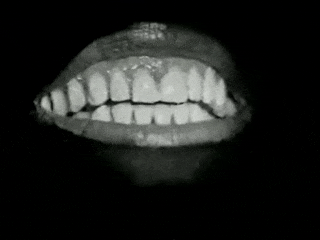

> D’abord le corps. Non. D’abord le lieu. Non. D’abord les deux. Tantôt l’un ou l’autre. Tantôt l’autre ou l’un. Dégoûté de l’un essayer l’autre. Dégoûté de l’autre retour au dégoût de l’un. Encore et encore. Tant mal que pis encore. Jusqu’au dégoût des deux. Vomir et partir. Là où ni l’un ni l’autre. Jusqu’au dégoût de là. Vomir et revenir. Le corps encore. Où nul. Le lieu encore. Où nul. Essayer encore. Rater encore. Rater mieux encore. Ou mieux plus mal. Rater plus mal encore. Encore plus mal encore. Jusqu’à être dégoûté pour de bon. Vomir pour de bon. Partir pour de bon. Là où ni l’un ni l’autre pour de bon. Une bonne fois pour toutes pour de bon.

— Samuel Beckett, _Worstward Ho_, écrit en 1982, publié en 1983 par Calder, Londres et Grove Press, New York. Traduit et publié en France en 1991 par Les Éditions de Minuit.

